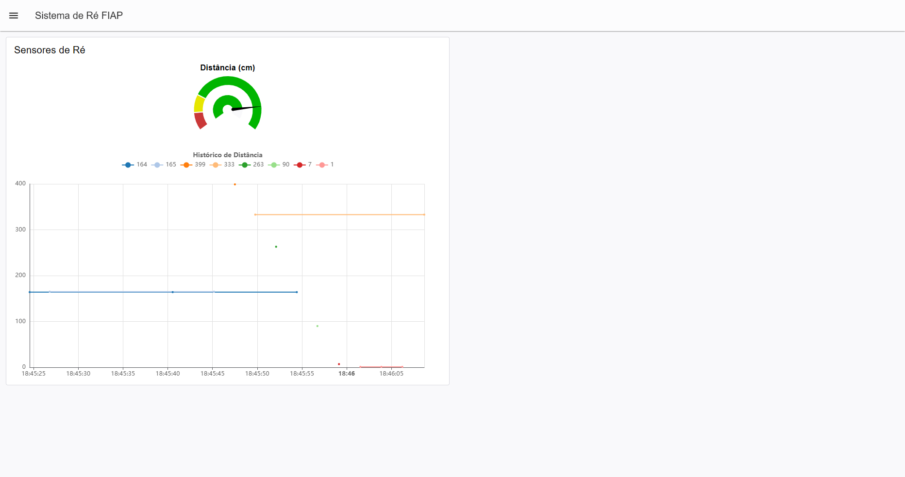
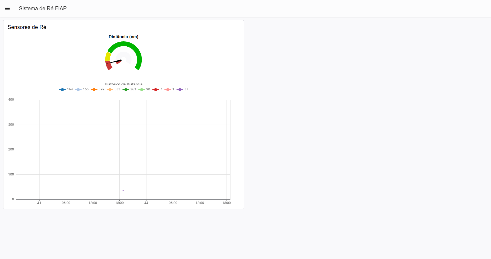
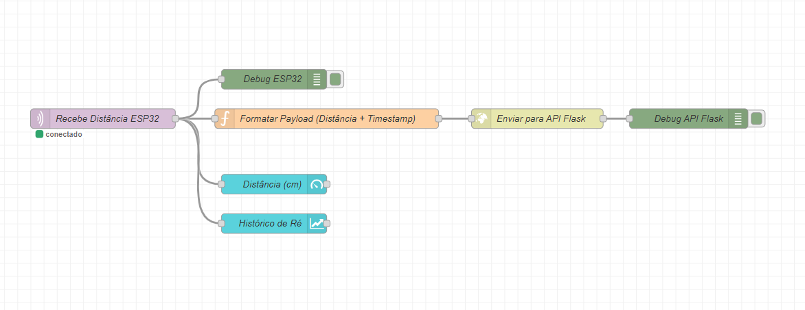

# Checkpoint 02 - IoT
## Sistema de Ré Automotiva com MQTT (FIAP)

**Nomes e RMs:**
- RM559094 - Victor Rodriguez

### 🔗 Link do Wokwi
[Link do Projeto no Wokwi](https://wokwi.com/projects/475808294441709569)

---

### 🖼️ Prints e Arquivos Node-RED

**1. Arquivo do fluxo:**
O arquivo `flows.json` está incluído na pasta `node_red`.

**2. Print do Fluxo no Node-RED:**

**3. Print do Dashboard no Node-RED:**

---

### 📡 Instruções Adicionais (para o corretor)
A API foi desenvolvida em Flask e está na pasta `api_flask`. 
- Ao rodar o ESP32 (Wokwi) ou o fluxo (Node-RED), a distância lida pelo HC-SR04 é enviada ao broker MQTT (`broker.hivemq.com`), que chega no Node-RED.
- O Node-RED formata com a data/hora atual e envia via POST HTTP para a API Flask.
- A API salva as informações localmente no arquivo `dados.json`.
